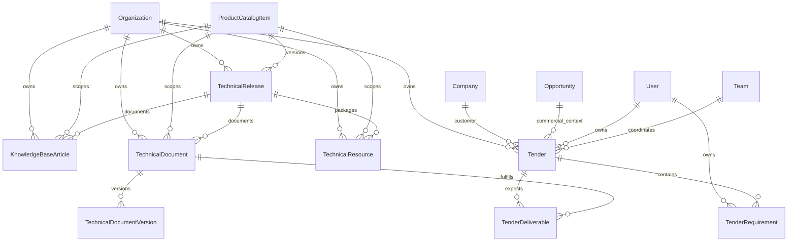

# Technical Center domain (Phase 4.1)

## Scope and decisions

Phase 4.1 establishes the tenant-owned backend domain and API for technical releases, knowledge, controlled documents, reusable resources, and technical tenders. `Organization` is the tenant boundary. The existing global `ProductCatalogItem` remains the product source of truth; releases and all working records are owned by an organization.

Opportunity remains the sales pipeline aggregate. A tender is an independent aggregate that may reference one company and one opportunity. This avoids overloading opportunity stages with a detailed tender workflow while retaining commercial traceability.

Document history uses immutable `TechnicalDocumentVersion` rows. Release, document, and tender headers use an integer `revision` for optimistic concurrency. Knowledge article revision history is intentionally deferred; publication state and review dates are included now.

A Knowledge Base article is editable reusable guidance with a publishing/review workflow. A Technical Document is a governed record with confidentiality, effective/expiry dates, immutable file versions, and approval/activation states. They are deliberately separate aggregates.

Important invariants: product/version is unique per tenant release; KB slug is unique per tenant; document version is unique within its tenant/document; cross-tenant links are rejected before write; archived governed records cannot be mutated; and tender requirements/deliverables cannot change after a final result.

## Entity relationship overview

Every tenant-owned table carries `organizationId`. Cross-domain identifiers supplied by clients are resolved within that organization before mutation. File attachments reuse `FileAttachment` with the new entity types `TECHNICAL_DOCUMENT` and `TECHNICAL_RESOURCE`.

The upload workflow remains consistent with the existing attachment API: create the document/resource metadata first, upload a file against its returned ID and the matching technical entity type, then add a document version or patch the resource with that attachment ID. The service verifies organization, entity type, entity ID, and non-deleted attachment state before linking it; file bytes stay in the configured local/MinIO provider rather than PostgreSQL.

## Lifecycle matrices

### Release

| From | To | Permission | Notes |
|---|---|---|---|
| DRAFT | PLANNED, ARCHIVED | `technical-release:manage` | Schedule or withdraw |
| PLANNED | DRAFT, ARCHIVED | `technical-release:manage` | Reschedule or withdraw |
| PLANNED | RELEASED | `technical-release:publish` | Sets release date when absent |
| RELEASED | DEPRECATED | `technical-release:publish` | Deprecation authority |
| RELEASED | ARCHIVED | `technical-release:manage` | Explicit governed archive |
| DEPRECATED | END_OF_LIFE | `technical-release:publish` | Final support milestone |
| DEPRECATED, END_OF_LIFE | ARCHIVED | `technical-release:manage` | Terminal archive |
| ARCHIVED | any | — | Not allowed |

### Knowledge article

| From | To | Permission | Notes |
|---|---|---|---|
| DRAFT | IN_REVIEW, ARCHIVED | `technical-knowledge:manage` | Submit or withdraw |
| IN_REVIEW | DRAFT, ARCHIVED | `technical-knowledge:manage` | Return or withdraw |
| IN_REVIEW | PUBLISHED | `technical-knowledge:publish` | Records publish/review timestamps |
| PUBLISHED | IN_REVIEW, ARCHIVED | `technical-knowledge:manage` | Revise or archive |
| ARCHIVED | any | — | Not allowed |

### Technical document

| From | To | Permission | Notes |
|---|---|---|---|
| DRAFT | IN_REVIEW, ARCHIVED | `technical-document:manage` | Submit or withdraw |
| IN_REVIEW | DRAFT, ARCHIVED | `technical-document:manage` | Return or withdraw |
| IN_REVIEW | APPROVED | `technical-document:approve` | Approves latest version metadata when present |
| APPROVED | ACTIVE | `technical-document:approve` | Sets effective date when absent |
| APPROVED | ARCHIVED | `technical-document:manage` | Withdraw approved document |
| ACTIVE | SUPERSEDED | `technical-document:approve` | Replaced by a governed successor |
| ACTIVE | EXPIRED, ARCHIVED | `technical-document:manage` | Expiry or archive |
| SUPERSEDED, EXPIRED | ARCHIVED | `technical-document:manage` | Terminal archive |
| ARCHIVED | any | — | Not allowed |

Document versions are append-only and unique by tenant, document, and version label.

### Tender

| From | To | Permission | Notes |
|---|---|---|---|
| DRAFT | IDENTIFIED | `technical-tender:manage` | Start pursuit |
| IDENTIFIED | QUALIFICATION | `technical-tender:manage` | Qualification gate |
| QUALIFICATION | PREPARING | `technical-tender:manage` | Begin response |
| PREPARING | TECHNICAL_REVIEW | `technical-tender:manage` | Technical gate |
| TECHNICAL_REVIEW | PREPARING, COMMERCIAL_REVIEW | `technical-tender:manage` | Rework or advance |
| COMMERCIAL_REVIEW | TECHNICAL_REVIEW, READY_FOR_SUBMISSION | `technical-tender:manage` | Rework or advance |
| READY_FOR_SUBMISSION | COMMERCIAL_REVIEW | `technical-tender:manage` | Rework |
| READY_FOR_SUBMISSION | SUBMITTED | `technical-tender:submit` | Submission authority |
| SUBMITTED | UNDER_EVALUATION | `technical-tender:manage` | Customer evaluation |
| UNDER_EVALUATION | CLARIFICATION | `technical-tender:manage` | Clarification loop |
| CLARIFICATION | UNDER_EVALUATION | `technical-tender:manage` | Resume evaluation |
| UNDER_EVALUATION | WON, LOST | `technical-tender:close` | Stores result and reason |
| Any pre-final state | CANCELLED | `technical-tender:close` | Explicit cancellation |
| WON, LOST, CANCELLED | ARCHIVED | `technical-tender:close` | Terminal archive |
| Terminal/ARCHIVED | other | — | Not allowed; no implicit reopen |

The tender lifecycle is distinct from Opportunity stages. Review stages allow only the documented one-step rollback.

## Permission matrix

| Area | Read | Ordinary mutation | Privileged lifecycle |
|---|---|---|---|
| Releases | `technical-release:view` | `technical-release:manage` | `technical-release:publish` |
| Knowledge | `technical-knowledge:view` | `technical-knowledge:manage` | `technical-knowledge:publish` |
| Documents | `technical-document:view` | `technical-document:manage` | `technical-document:approve` |
| Resources | `technical-resource:view` | `technical-resource:manage` | — |
| Tenders | `technical-tender:view` | `technical-tender:manage` | `technical-tender:submit`, `technical-tender:close` |

System ADMIN receives all permissions. The default MANAGER role receives the complete technical-center set. REP and BOARDS receive view permissions only. Tenant administrators can continue assigning these system permissions to custom and system roles through the existing RBAC management APIs.

## HTTP API

All routes are below `/technical`, require JWT authentication, apply the permission guard, and derive tenant scope from authenticated membership context.

| Resource | Routes |
|---|---|
| Releases | `GET/POST /releases`, `GET/PATCH /releases/:id`, `POST /releases/:id/transition` |
| Knowledge | `GET/POST /knowledge-base`, `GET/PATCH /knowledge-base/:id`, `POST /knowledge-base/:id/transition` |
| Documents | `GET/POST /documents`, `GET/PATCH /documents/:id`, `POST /documents/:id/transition`, `GET/POST /documents/:id/versions`, `GET /documents/:id/versions/:versionId` |
| Resources | `GET/POST /resources`, `GET/PATCH /resources/:id` |
| Tenders | `GET/POST /tenders`, `GET/PATCH /tenders/:id`, `POST /tenders/:id/transition` |
| Requirements | `GET/POST /tenders/:id/requirements`, `PATCH/DELETE /tenders/:id/requirements/:requirementId` |
| Deliverables | `POST /tenders/:id/deliverables`, `DELETE /tenders/:id/deliverables/:deliverableId` |

List routes return `{ data, meta }` and support page/limit plus relevant search, relationship, status, type, owner, and date filters. Invalid lifecycle transitions return `INVALID_LIFECYCLE_TRANSITION`. Stale revision mutations return `REVISION_CONFLICT`.

## Audit and archive behavior

Every create, update, transition, version addition, requirement change, and deliverable change writes a tenant audit event with actor, membership, organization, entity, action, before/after snapshots where applicable, and the lifecycle reason. Audited metadata excludes file bytes and credentials.

Archival is a terminal lifecycle transition for releases, articles, documents, and tenders. Archived records remain addressable for traceability but are omitted from normal lists and cannot be mutated. Technical resources use their `ARCHIVED` status and timestamp through the normal update endpoint. Tender children cannot be changed after a final result or archive.

Governed parent relations use `RESTRICT` where deleting the parent would destroy history (organization, release product, document/version, tender children). Optional CRM context uses `SET NULL` so archiving or removal of a company/opportunity link does not destroy the technical record. User owners/creators are restricted when accountability is required; optional reviewers/leads use `SET NULL`. No new governed relation uses cascade delete.

## Migration and operations

Migration `20260829170000_add_technical_center_domain` is additive: it creates enums, tables, indexes, foreign keys, permissions, and ADMIN grants, and extends the attachment enum. It does not rewrite or delete existing business data. Deploy with the normal `prisma migrate deploy` process and run Prisma Client generation before application startup.

Rollback is application-first: deploy the previous application, then remove the new tables only after confirming they contain no required data. PostgreSQL enum values cannot be safely removed in-place; they may remain harmlessly if a rollback is required. Production backup and migration safety checks remain mandatory.

## Deferred from Phase 4.1

- Frontend screens and navigation (Phase 4.2)
- Knowledge article immutable revision history
- External publication portal and public visibility
- Tender scoring automation, notifications, and scheduled deadline jobs
- Binary antivirus/content scanning beyond the existing attachment pipeline
